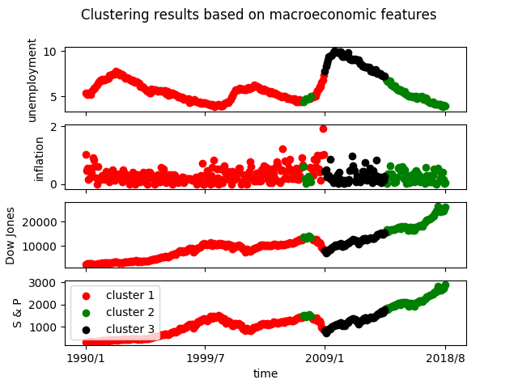

   
The first step in our stock prices movement prediction algorithm is to cluster the months in the
training sets into 3 clusters based on 4 macroeconomic features: unemployment rate, inflation rate,
level of Dow Jones Industrial Averages and level of S & P 500. 

In the previous plot, we displayed the clutering results based on KMean clustering algorithm. Each
point represents a certain month and its color represents a cluster it belongs to.

As displayed in the plot, the clustering algorithm really nicely separated data into 3 distinct
clusters. 
